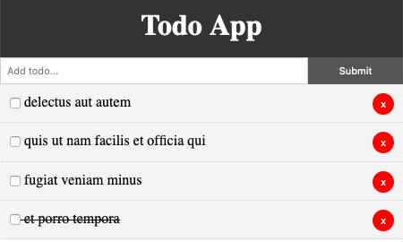

# Todo App

A simple and easy to use UI to add, delete, and complete tasks.

Initial tasks are retrieved from JSONPlaceholder and any tasks that are deleted are also mock deleted on their server.

Built using Vue.js

